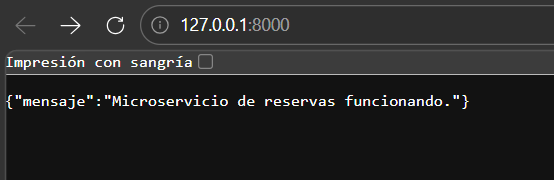
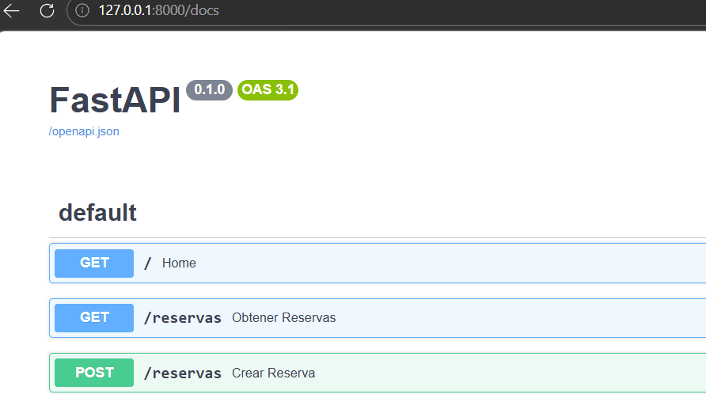
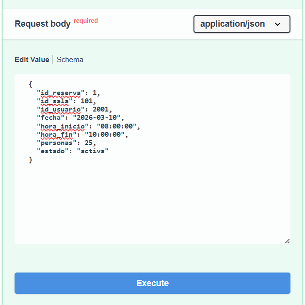
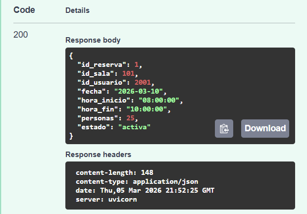
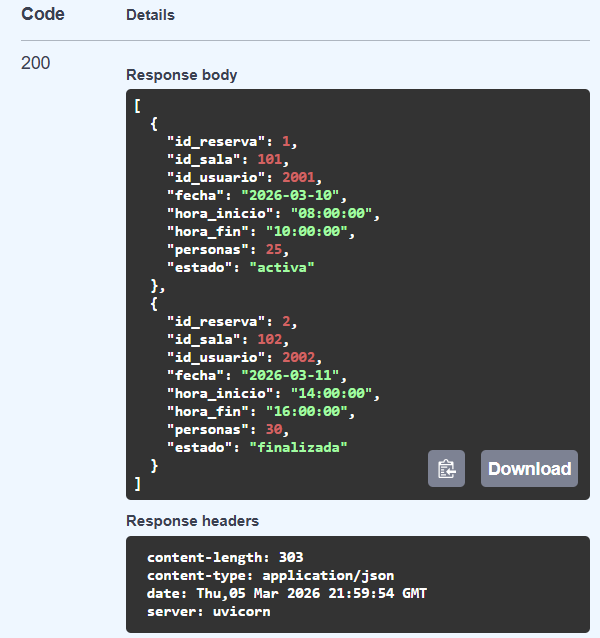
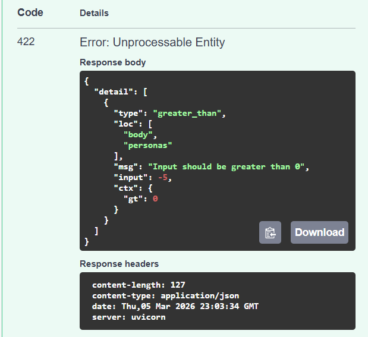

# Aplicaciones-y-servicios-web-2026-01
Repositorio para la materia Aplicaciones y servicios web en el primer semestre del 2026

# Taller 1

[Primer taller](apps_services-clase-04-taller-1/Taller-1.pdf)

## Microservicio de Gestión de Reservas

### Descripción
La universidad desea desarrollar un sistema digital que permita registrar las reservas de salas utilizadas en actividades académicas.
 > Desarrollo con FastAPI para registrar y consultar reservas de salas académicas.

### Instalación
Seguir las instrucciones:

en alguna terminal (cmd, powershell, terminal de linux/macOs), situarse en la carpeta del proyecto.

Crear entorno virtual
```bash
python -m venv venv
```

Activar entorno virtual
```bash
source venv/bin/activate #Linux/macOs
venv\Scripts\activate   # Windows
```
Instalar dependencias
```bash
pip install -r requirements.txt
```

### Ejecucion
Ejecutar el comando de uvicorn para levantar el servidor y actualizarlo automaticamente cada que se cambie el codigo.
```bash
uvicorn main:app --reload
```
Ir a la direccion en la cual esta corriendo el servidor con uvicorn
```bash
INFO:     Uvicorn running on http://127.0.0.1:X (X es el puerto por defecto de uvicorn, usualmente 8000)
http://127.0.0.1:8000
```

Despues de verificar que funciona


Ir a la documentacion con Swagger
```bash
http://127.0.0.1:8000/docs
```


### Testing

Para poder obtener reservas, primero hay que crearlas, entonces nos vamos al endpoint POST /reservas y en el boton que dice "Try out", lo presionamos para probar la api y crear la reserva.

Al pedirnos el body, usaremos los valores del archivo **reservas_prueba.json**, usando el primer modelo para verificar que lo crea


Nos mostrara un response con codigo 200, lo que significa que proceso con exito nuestra api


Ahora haremos lo mismo con el segundo modelo del Json de prueba para pasar a la siguiente api, que es el GET /reservas para obtener las reservas registradas.

El GET no cuenta con parametros, por lo que se ejecuta directamente sin ningun tipo de body, y nos devolveria las reservas que se hayan registrado en el response, nuevamente, con codigo 200, indicando que se proceso con exito la api.



Y para validacion de datos con Pydantic, ingresaremos el tercer modelo del Json de prueba, que contiene la variable de personas, con las funcion Field, con el parametro gt (greater than) para que valide que sea mayor a 0.

De prueba, usaremos el valor -5 (Es imposible que en un aula hayan -5 personas o que hayan 0 dentro de un horario de reserva), lo cual nos mostrara un response con codigo 422, que significa que los datos enviados son erroneos/no procesables.



